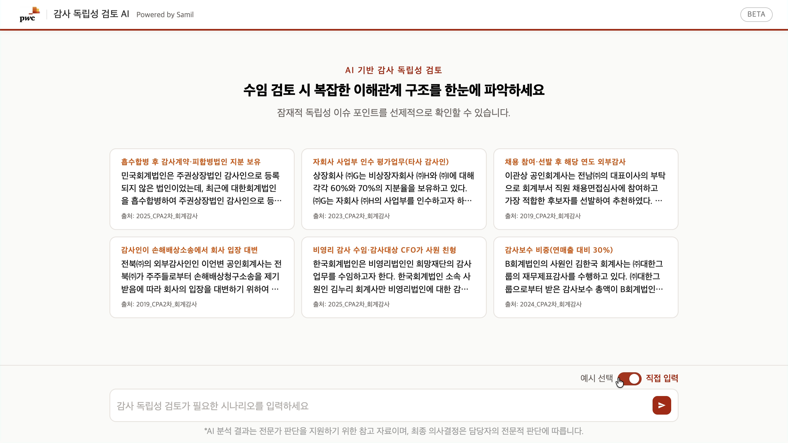

# 🔍 [audit-chat] AI 기반 회계감사 독립성 분석 엔진 

> 감사인이 특정 고객의 감사를 맡아도 되는지 판단하는 **독립성 검토**를 AI로 자동화한 웹 애플리케이션입니다.

[](https://python.org)
[](https://fastapi.tiangolo.com)
[](https://neo4j.com)
[](https://streamlit.io)

---

## 🎬 데모

[](https://drive.google.com/drive/folders/1JgG3vykhsO898z7PuJpC2QAV8D4tTeKy)
> 이미지 클릭 시 데모 영상으로 이동합니다.

---

## 💡 어떤 문제를 풀었나요?

회계·감사 업계에서는 **감사인이 고객과 어떤 관계에 있는지**에 따라 독립성이 훼손될 수 있습니다.  
예를 들어 친인척이 임원으로 있거나, 과거에 해당 회사 직원이었다면 감사를 맡을 수 없습니다.

기존에는 이 검토를 **사람이 수동으로** 했습니다.  
Audit Chat은 시나리오를 입력하면 **LLM이 인물·회사·관계를 자동 추출**하고, **관련 법령과 기준에 비추어 수임 가능 여부를 판단**해 리포트로 출력합니다.

---

## 🎬 주요 기능

| 기능 | 설명 |
|------|------|
| 📝 시나리오 분석 | 자연어로 입력한 상황 설명에서 인물·회사·관계를 자동 추출 |
| ⚖️ 독립성 판단 | 공인회계사법·윤리기준에 따라 수임 가능 여부와 위험도 산출 |
| 🕸️ 관계도 시각화 | 추출된 이해관계자 구조를 다이어그램(Mermaid)으로 자동 렌더링 |
| 📄 리포트 출력 | 결론·근거 조항·위험 요인을 구조화된 형식으로 정리 |
| 🔗 법령 링크 | 판단 근거가 된 법령 조항을 클릭 가능한 링크로 제공 |

---

## 🏗️ 아키텍처

```
사용자 입력 (시나리오 텍스트)
        │
        ▼
┌──────────────────┐
│  Frontend        │  ← Streamlit 앱 / PwC 스타일 정적 HTML
│  (화면·입력)     │
└────────┬─────────┘
         │ HTTP 요청
         ▼
┌──────────────────┐
│  Backend API     │  ← FastAPI
│  (비즈니스 로직) │
│                  │
│  ┌────────────┐  │
│  │ LLM 분석  │  │  ← OpenAI API (관계 추출 · 독립성 판단)
│  └────────────┘  │
│  ┌────────────┐  │
│  │ Neo4j 저장│  │  ← 인물·회사·관계를 그래프 DB에 저장
│  └────────────┘  │
└────────┬─────────┘
         │ 결과 반환
         ▼
리포트 + 관계도(Mermaid) + 법령 링크
```

### 설계 원칙

- **그래프 DB 활용** — 관계 중심 데이터(사람-회사-역할)를 Neo4j 그래프 구조로 표현해 복잡한 이해관계 탐색 최적화
- **확장 가능 구조** — 새 법령·판단 기준은 데이터와 프롬프트만 수정하면 반영 가능

---

## 🗂️ 프로젝트 구조

```
audit-chat/
├── backend/          # FastAPI 서버, DB 연결, 분석 서비스
├── frontend/         # Streamlit 앱
├── static/           # PwC 스타일 정적 HTML UI
├── data/law/html/    # 법령 원문 데이터
├── docs/             # 아키텍처·기여 가이드 문서
├── scripts/          # 유틸리티 스크립트 (git hooks 등)
├── .env.example      # 환경 변수 템플릿
├── docker-compose.yml
└── run.sh            # 전체 앱 실행 스크립트
```

---

## 🛠️ 기술 스택

| 영역 | 기술 | 선택 이유 |
|------|------|-----------|
| Frontend | Streamlit, HTML | 빠른 프로토타이핑, PwC 감사 UI 재현 |
| Backend | FastAPI | 비동기 처리, 자동 API 문서화(/docs) |
| Graph DB | Neo4j | 사람·회사·역할 간 복잡한 관계 탐색에 최적 |
| AI 분석 | OpenAI LLM | 자연어 시나리오에서 구조화된 관계 추출 |
| 관계도 | Mermaid.js | 코드 기반 다이어그램 자동 렌더링 |
| 컨테이너 | Docker Compose | Neo4j + 앱 일괄 실행 환경 구성 |

---

## 🚀 빠른 시작

### 사전 요건
- Python 3.9+ (권장 3.11)
- Docker (Neo4j 실행용, 선택사항)
- OpenAI API 키

### 설치 및 실행

```bash
# 1. 저장소 클론
git clone https://github.com/psych3ma/audit-chat.git
cd audit-chat

# 2. 환경 설정 (최초 1회)
make venv
source venv/bin/activate       # Windows: venv\Scripts\activate
cp .env.example .env            # .env 파일에 API 키·DB 주소 입력

# 3. 실행
./run.sh
```

| 서비스 | 주소 |
|--------|------|
| 메인 UI (PwC 스타일) | http://localhost:8001 |
| Streamlit 앱 | http://localhost:8501 |
| API 문서 (Swagger) | http://localhost:8001/docs |

> **UI만 미리 보고 싶다면** (DB·LLM 연결 없이):
> ```bash
> python run_static_only.py
> ```

---

## 📐 상세 문서

- [`docs/ARCHITECTURE.md`](docs/ARCHITECTURE.md) — 레이어 설계, 데이터 흐름 상세 다이어그램
- [`docs/CONTRIBUTING.md`](docs/CONTRIBUTING.md) — 개발 환경 세팅, PR 가이드

---

## 🔒 환경 변수

`.env.example`을 복사해 `.env`로 사용하세요. `.env`는 `.gitignore`에 포함되어 저장소에 올라가지 않습니다.

```
OPENAI_API_KEY=sk-...
NEO4J_URI=bolt://localhost:7687
NEO4J_USER=neo4j
NEO4J_PASSWORD=your-password
API_PORT=8001
```

---

## 📝 개발 배경

공인회계사 시험을 준비하며 독립성 기준의 복잡성을 경험했습니다.  
감사인이 수백 가지 관계 유형을 기억하고 적용해야 하는 과정을 **자동화하면 실무 부담을 줄일 수 있다**는 아이디어에서 출발했습니다.  
그래프 DB와 LLM을 결합해 관계 기반 법적 판단을 구조화하는 것이 핵심 기술적 도전이었습니다.

---

<div align="center">
  <sub>데이터 출처: CPA2차 회계감사 기출 · Made with Cursor AI</sub>
</div>
