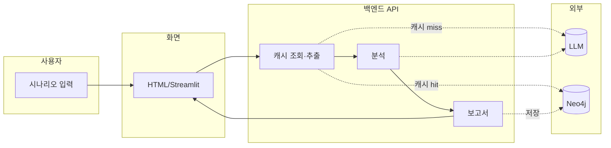
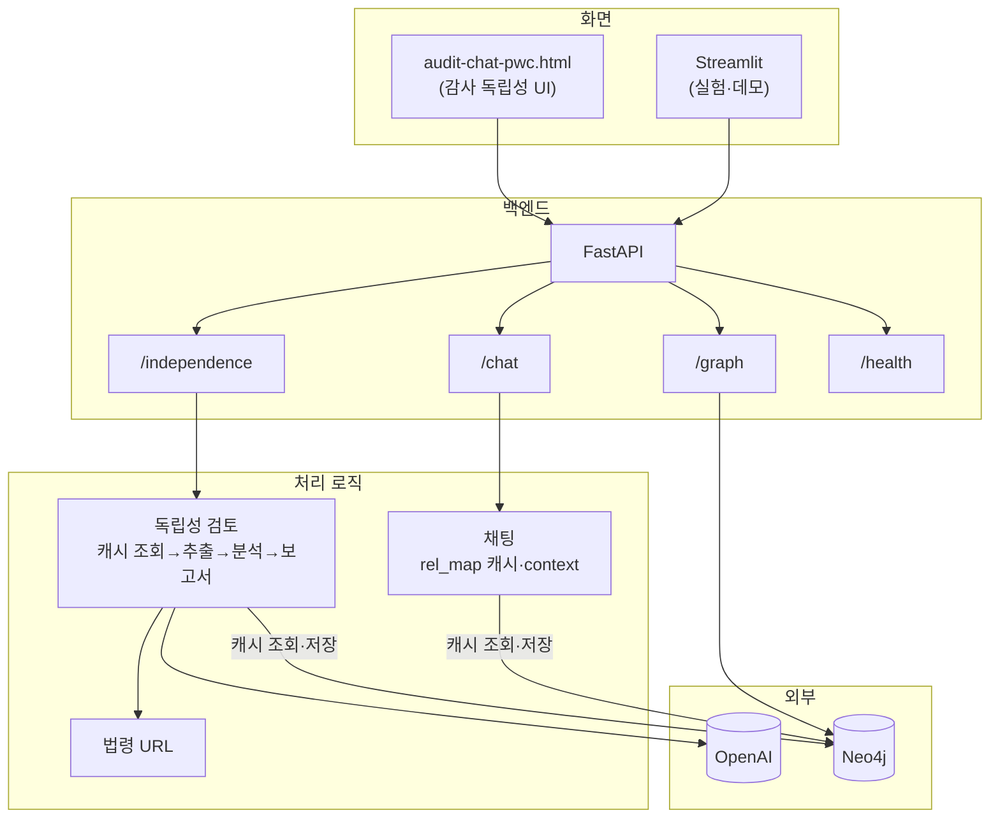

# Audit Chat — 시스템 아키텍처

감사 독립성 검토 AI의 **구성 원칙**, **데이터 흐름**, **역할 분리**를 정리한 문서입니다.  
(확장성·유지보수성·협업을 고려한 구조)

---

## 0. 아키텍처 원칙 (요약)

| 원칙 | 내용 |
|------|------|
| **역할 분리** | 화면(프론트) / API·비즈니스 로직(백엔드) / 관계 저장·캐시(Neo4j) 분리. 화면·로직 변경이 서로 영향을 최소화하도록 구성. |
| **데이터 흐름** | 시나리오 → 추출(또는 Neo4j 캐시) → 분석(LLM) → 보고서(Mermaid·법령 URL·Neo4j 저장). 채팅은 동일 캐시 정책으로 rel_map을 context에 활용. |
| **캐시 정책** | `get_trace_id(scenario)`로 동일 시나리오 판별. Neo4j에 rel_map이 있으면 추출 LLM 생략(채팅·독립성 공통). 분석은 매 요청마다 수행. |
| **API 설계** | 독립성 검토는 단계별(/extract, /analyze, /report)로 진행률 노출·디버깅 용이. 일괄 호출(/review)도 동일 로직 사용. |
| **설정·URL** | `.env`·`config` 일원화. 프론트 API 베이스는 `API_BASE_URL`/`API_PORT`로 주입(run.sh에서 설정). |

---

## 1. 한눈에 보기

- **사용자**가 시나리오를 입력하면 **화면(프론트)** 이 **백엔드 API**로 보냅니다.
- **백엔드**는 **관계 추출**(동일 시나리오면 Neo4j 캐시 재사용) **→ 독립성 분석(LLM) → 보고서 생성** 순서로 진행하며, **LLM(OpenAI)** 과 **Neo4j(캐시·저장)** 를 사용합니다.
- 결과는 **결론·관계도(Mermaid)·법령 링크**로 돌려주고, **화면**에서 카드 형태로 보여 줍니다.


*캐시 조회·추출: `get_trace_id` → Neo4j 조회 → 있으면 재사용, 없으면 LLM 추출 후 저장.*

---

## 2. 시스템 구성 (블록 단위)


*캐시: `get_trace_id(scenario)`로 Neo4j에서 rel_map 조회; 있으면 추출 LLM 생략.*

---

## 3. API 정리 (현재 코드 기준)

| 용도 | 메서드·경로 | 설명 |
|------|-------------|------|
| 준비 확인 | `GET /ready` | 서버 기동 대기용 (바로 200 반환) |
| 헬스체크 | `GET /health` | 서버·Neo4j 연결 상태 |
| 독립성 검토 (한 번에) | `POST /independence/review` | 시나리오 → 추출(캐시 우선)·분석·보고서 일괄 |
| 독립성 검토 (단계별) | `POST /independence/extract` | 1단계: 관계 추출 (Neo4j 캐시 있으면 재사용) |
| | `POST /independence/analyze` | 2단계: 독립성 분석 |
| | `POST /independence/report` | 3단계: 보고서 생성(법령 URL, Mermaid, Neo4j 저장) |
| 채팅 | `POST /chat/completions` | 일반 대화형 채팅 (동일 시나리오면 Neo4j rel_map 재사용) |
| 그래프 | `GET /graph/mermaid` | Neo4j 데이터를 Mermaid로 반환 |
| 화면 | `GET /`, `GET /pwc` | 감사 독립성 UI로 리다이렉트 |

**참고**: PwC UI(`audit-chat-pwc.html`)는 **단계별 API**(extract → analyze → report)를 호출해 진행률을 표시합니다.

---

## 4. 독립성 검토 흐름 (단계별)

```
시나리오 입력
    → get_trace_id(scenario) → Neo4j 조회
    → 캐시 있음: rel_map 재사용 / 없음: POST /independence/extract (관계 추출, GPT-4o-mini)
    → POST /independence/analyze (독립성 분석, GPT-4o)
    → POST /independence/report (법령 URL 보강, Mermaid 생성, Neo4j 저장)
    → 화면에 리포트 카드 표시 (관계도·결론·법령 링크)
```

- **추출**: 시나리오에서 인물·회사·관계를 구조화해 뽑습니다. 동일 시나리오면 Neo4j에서 rel_map을 먼저 조회해 추출 LLM 생략.
- **분석**: 그 구조를 바탕으로 수임 가능 여부·위험도·이슈를 판단합니다.
- **보고서**: 분석 결과에 법령 링크를 붙이고, 관계도를 Mermaid로 만들며, Neo4j에 저장합니다.

---

## 5. 폴더 구조 (요약)

```
audit-chat/
├── backend/              # 백엔드 (FastAPI)
│   ├── main.py           # 앱 진입점, 라우터 등록, 정적 파일 서빙
│   ├── config.py         # 설정 (.env)
│   ├── database.py       # Neo4j 연결
│   ├── routers/          # API 경로 (independence, chat, graph, health)
│   ├── services/         # 비즈니스 로직 (independence_service, llm_*, law_registry 연동)
│   ├── models/           # 요청·응답 스키마 (independence, schemas)
│   └── utils/
│       └── law_registry.py   # 법령 URL 생성 (CSV 기반)
├── frontend/             # Streamlit 앱 (app.py, pages/, api_client)
├── static/
│   └── audit-chat-pwc.html   # 감사 독립성 UI (단일 페이지, 백엔드가 서빙)
├── docs/
│   ├── ARCHITECTURE.md   # 본 문서 (유일하게 버전 관리)
│   └── archive/          # 과거 검토·설계 문서 (git 제외)
├── run.sh                # 백엔드 + Streamlit 동시 실행
├── run_static_only.py    # Neo4j 없이 HTML만 서빙 (선택)
├── requirements.txt
└── .env.example          # 환경 변수 예시 (.env는 미커밋)
```

### 5.1 정적 파일 위치

- **현재**: 루트 `static/`. `backend/main.py`는 `Path(__file__).resolve().parent.parent / "static"`으로 참조.
- **선택**: 배포 단위 일원화를 위해 `backend/static/`으로 이전 가능. 이전 시 `main.py`의 `STATIC_DIR`, `run_static_only.py`의 `STATIC_DIR`만 수정. URL(`/static/...`)은 동일 유지.

### 5.2 모듈 구성 (비개발자용)

| 모듈 | 하는 일 |
|------|---------|
| **backend** | 사용자 입력을 받아, 관계 추출·독립성 분석·보고서를 만드는 **서버**입니다. API·DB·분석 로직이 들어 있습니다. |
| **frontend** | 사용자가 보는 **Streamlit 화면**(홈, 독립성 검토, 채팅, 그래프)과, 백엔드 호출용 **api_client**입니다. |
| **static** | 브라우저에서 바로 여는 **감사 독립성 UI** 한 페이지(HTML). 백엔드가 제공합니다. |
| **run.sh** | 백엔드와 Streamlit을 **한 번에 실행**할 때 사용합니다. |
| **run_static_only.py** | Neo4j 없이 **HTML 화면만** 띄울 때 사용합니다. 검토 API는 동작하지 않습니다. |

---

## 6. 기술 스택

| 역할 | 기술 |
|------|------|
| 백엔드 | FastAPI, Pydantic, uvicorn |
| 화면 | HTML/CSS/JS(정적), Streamlit |
| LLM | OpenAI (GPT-4o-mini: 추출, GPT-4o: 분석) |
| DB | Neo4j (관계 저장·조회) |
| 시각화 | Mermaid (관계도), mermaid.ink(이미지) |
| 설정 | pydantic-settings, .env |

---

## 7. Neo4j ↔ LLM·캐시 정책

| 경로 | Neo4j를 LLM 입력으로 쓰는가? | 설명 |
|------|------------------------------|------|
| **`/chat/completions`** | ✅ 사용 | `get_trace_id(scenario)`로 Neo4j에서 rel_map 조회 → 있으면 context에 넣어 LLM 호출(추출 생략). 없으면 추출 후 저장·context 사용. |
| **`/independence/*`** (extract / review) | ✅ 사용 | 동일: `get_trace_id(scenario)`로 Neo4j 조회 → 있으면 추출 LLM 생략 후 분석으로 진행. 없으면 추출 후 분석·보고서. report 단계에서 저장. |

- **공통**: `get_trace_id(scenario)`로 캐시 키 통일. 채팅·독립성 검토 모두 "같은 시나리오면 추출 1회만" 정책으로 확장·유지보수·협업 시 일관됨.

---

## 8. 확장·유지보수·협업

- **확장성**: 새 기능은 라우터·서비스만 추가하면 되고, 화면·백엔드·DB를 역할별로 나눠 두어 부담을 분산할 수 있습니다. 캐시 키(`get_trace_id`)와 Neo4j 스키마를 공통으로 두어 채팅·독립성 검토가 같은 정책을 공유합니다.
- **유지보수성**: 설정은 `.env`·`config`로 일원화하고, 비즈니스 로직은 `independence_service`에 집중되어 라우터는 얇게 유지됩니다.
- **협업**: 프론트/백엔드/데이터를 팀 단위로 나눠 담당하기 쉽고, 단계별 API로 진행률·디버깅을 맞추기 좋습니다.

---

## 9. 문서 정책

- **버전 관리**: `docs/`에서는 **본 문서(ARCHITECTURE.md)** 만 Git으로 관리합니다.
- **archive**: `docs/archive/`는 **개인·내부 작업용** 보관함이며, 포트폴리오·공유용이 아닙니다. **.gitignore로 제외**되어 원격 저장소에 올라가지 않습니다.
- **서비스 콘텐츠**: 감사 시나리오 텍스트, LLM 시스템 메시지·프롬프트 등 **서비스 내용**에는 '전문가', 'Senior Partner' 등 직급·역할 표현을 그대로 둡니다. (주석이 아닌 서비스 정의이므로.)

---

## 10. 그래프 DB(Neo4j) 정리

아키텍처 다이어그램에서 **보고서 → Neo4j(저장)** 과 **내부 시스템 ↔ LLM·Neo4j** 가 나오는 부분을 정리하고, 비개발자도 이해할 수 있게 설명합니다.

### 10.1 Neo4j 데이터 모델·역할

| 항목 | 내용 |
|------|------|
| **데이터 모델** | **노드**: `IndependenceEntity` (감사 시나리오에서 추출한 인물·회사 등). 속성: `trace_id`, `id`, `label`, `name`. **관계**: `RELATION` (엣지). 속성: `rel_type` (예: 소속, 감사대상, 직계가족). 시나리오별로 `trace_id`를 붙여 **실행 단위 서브그래프**로 분리해 저장. |
| **그래프를 쓰는 이유** | 감사 독립성 검토에서 중요한 것은 “누가 누구와 어떤 관계인가”입니다. 테이블로만 두면 “A가 B의 감사대상” 같은 **관계**를 여러 번 조인해야 하고, “이 회사와 연결된 모든 관계를 따라가기” 같은 질의가 번거롭습니다. Neo4j는 **관계를 일급 시민**으로 다루므로, “이 인물과 연결된 모든 위험 관계” 조회가 자연스럽습니다. |
| **캐시 전략** | `get_trace_id(scenario)`(시나리오 해시)로 **같은 시나리오 = 같은 그래프**로 취급. Neo4j에서 먼저 조회 → 있으면 추출 LLM 생략(비용·지연 절감), 없으면 LLM으로 추출 후 **보고서 단계에서 Neo4j에 저장**. 다이어그램의 “보고서 → 저장 → Neo4j”는 이 “한 번 만든 관계 맵을 그래프에 남겨 두는” 흐름을 나타냅니다. |
| **LLM과의 역할 분리** | LLM은 **비구조화 텍스트(시나리오)** 에서 **구조화된 엔티티·관계**를 뽑는 데 쓰이고, Neo4j는 그 결과를 **그래프로 저장·재조회**하는 데 씁니다. “추출(LLM) → 저장/조회(Neo4j)” 분리가 되어 있어, 나중에 다른 분석·대시보드에서 같은 그래프를 재사용하기 좋습니다. |
| **정리** | 다이어그램은 “보고서가 Neo4j에 저장한다”는 한 축을 잘 보여 줍니다. 실제 시스템에는 **저장 전에 Neo4j에서 캐시 조회**가 선행되므로, “캐시 조회(읽기) → 추출(캐시 미스 시) → 분석 → 보고서 → 저장(쓰기)” 전체를 떠올리면, 그래프 DB가 **캐시 + 관계 저장** 두 역할을 한다고 보면 됩니다. |

### 10.2 비개발자용 설명

**“Neo4j가 뭐고, 우리가 왜 쓰나요?”**

- 감사 시나리오에는 **사람, 회사, 그리고 그들 사이의 관계**(소속, 감사대상, 친인척 등)가 나옵니다. 이걸 **한 번 정리해 두면**, 같은 시나리오를 다시 넣었을 때 또 정리하지 않고 **이미 만든 관계 맵을 불러와서** 씁니다.  
  **Neo4j**는 이런 “누가 누구와 어떤 관계인지”를 **관계 중심**으로 저장하는 **그래프 데이터베이스**입니다. 일반 표처럼 “행/열”만 쓰는 DB와 달리, **연결 관계**를 빠르게 따라가고, “이 사람과 연결된 모든 위험 관계만 보기” 같은 질의를 하기 좋습니다.

**“다이어그램에서 보고서 → Neo4j(저장)가 나오는 이유”**

- 시나리오를 분석해 **보고서**를 만들 때, 그 안에 나온 **인물·회사·관계**를 Neo4j에 **저장**합니다.  
  그러면 다음에 **같은 시나리오**로 검토하거나 채팅할 때, **다시 추출하지 않고** Neo4j에서 꺼내 쓸 수 있어서, 비용과 시간을 줄일 수 있습니다.  
  즉, “보고서를 만들면서 나온 **핵심 정보(관계 맵)** 를 Neo4j에 남겨 두고, 나중에 **재사용**한다”고 보면 됩니다.

**“LLM은 어디서 쓰이나요?”**

- **LLM**은 시나리오 문장을 읽고, 그 안에서 **누가 누구고, 어떤 관계인지**를 **자동으로 뽑아 주는 역할**을 합니다.  
  그렇게 뽑은 결과를 Neo4j에 저장하고, 필요할 때 다시 꺼내서 **독립성 분석**이나 **채팅 답변**에 활용합니다.  
  정리하면, **LLM = 글에서 관계를 추출**, **Neo4j = 그 관계를 저장·조회**라고 이해하시면 됩니다.

---

*아키텍처나 API가 바뀌면 이 문서를 함께 갱신하는 것을 권장합니다.*
