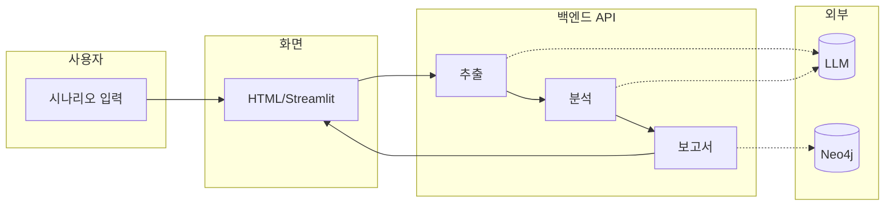
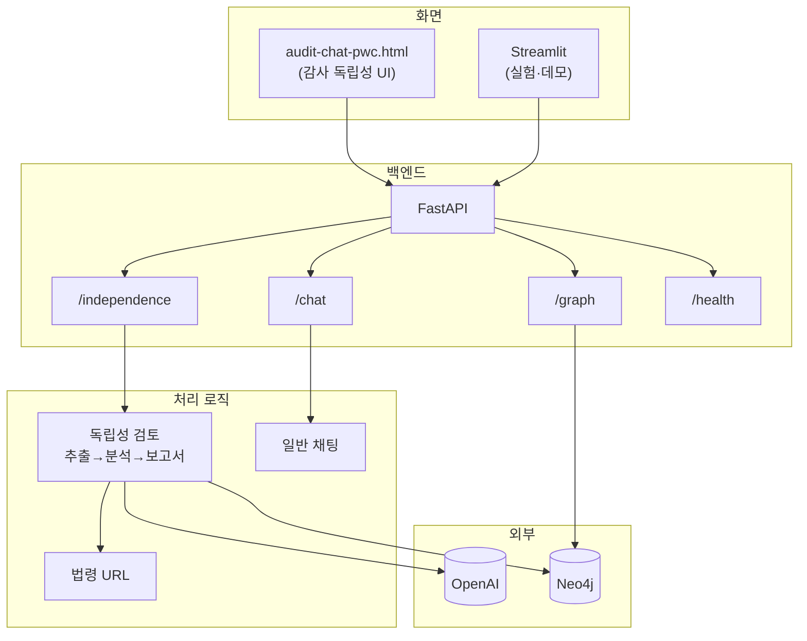

# Audit Chat — 시스템 아키텍처

감사 독립성 검토 AI의 **구성 원칙**, **데이터 흐름**, **역할 분리**를 정리한 문서입니다.  
(확장성·유지보수성·협업을 고려한 구조)

---

## 1. 한눈에 보기

- **사용자**가 시나리오를 입력하면 **화면(프론트)** 이 **백엔드 API**로 보냅니다.
- **백엔드**는 **관계 추출 → 독립성 분석 → 보고서 생성** 순서로 진행하고, 그 과정에서 **LLM(OpenAI)** 과 **관계 DB(Neo4j)** 를 사용합니다.
- 결과는 **결론·관계도(Mermaid)·법령 링크**로 돌려주고, **화면**에서 카드 형태로 보여 줍니다.

아래 다이어그램은 이 흐름을 블록 단위로 나타낸 것입니다.



---

## 2. 시스템 구성 (블록 단위)



---

## 3. API 정리 (현재 코드 기준)

| 용도 | 메서드·경로 | 설명 |
|------|-------------|------|
| 준비 확인 | `GET /ready` | 서버 기동 대기용 (바로 200 반환) |
| 헬스체크 | `GET /health` | 서버·Neo4j 연결 상태 |
| 독립성 검토 (한 번에) | `POST /independence/review` | 시나리오 → 추출·분석·보고서 일괄 |
| 독립성 검토 (단계별) | `POST /independence/extract` | 1단계: 관계 추출 |
| | `POST /independence/analyze` | 2단계: 독립성 분석 |
| | `POST /independence/report` | 3단계: 보고서 생성(법령 URL, Mermaid, Neo4j 저장) |
| 채팅 | `POST /chat/completions` | 일반 대화형 채팅 |
| 그래프 | `GET /graph/mermaid` | Neo4j 데이터를 Mermaid로 반환 |
| 화면 | `GET /`, `GET /pwc` | 감사 독립성 UI로 리다이렉트 |

**참고**: PwC UI(`audit-chat-pwc.html`)는 **단계별 API**(extract → analyze → report)를 호출해 진행률을 표시합니다.

---

## 4. 독립성 검토 흐름 (단계별)

```
시나리오 입력
    → POST /independence/extract   (관계 추출, GPT-4o-mini)
    → POST /independence/analyze  (독립성 분석, GPT-4o)
    → POST /independence/report   (법령 URL 보강, Mermaid 생성, Neo4j 저장)
    → 화면에 리포트 카드 표시 (관계도·결론·법령 링크)
```

- **추출**: 시나리오에서 인물·회사·관계를 구조화해 뽑습니다.
- **분석**: 그 구조를 바탕으로 수임 가능 여부·위험도·이슈를 판단합니다.
- **보고서**: 분석 결과에 법령 링크를 붙이고, 관계도를 Mermaid로 만들며, 필요 시 Neo4j에 저장합니다.

---

## 5. 폴더 구조 (요약)

```
audit-chat/
├── backend/              # 백엔드 (FastAPI)
│   ├── main.py           # 앱 진입점, 라우터 등록, 정적 파일 서빙
│   ├── config.py         # 설정 (.env)
│   ├── database.py       # Neo4j 연결
│   ├── routers/          # API 경로 (independence, chat, graph, health)
│   ├── services/         # 비즈니스 로직 (independence_service, llm_*, law_registry 연동)
│   ├── models/           # 요청·응답 스키마 (independence, schemas)
│   └── utils/
│       └── law_registry.py   # 법령 URL 생성 (CSV 기반)
├── frontend/             # Streamlit 앱 (app.py, pages/, api_client)
├── static/
│   └── audit-chat-pwc.html   # 감사 독립성 UI (단일 페이지)
├── docs/                 # 문서 (본 파일, WORKFLOW_* 등)
├── run.sh                # 백엔드 + Streamlit 동시 실행
├── run_static_only.py    # Neo4j 없이 HTML만 서빙 (선택)
├── requirements.txt
└── .env.example          # 환경 변수 예시 (.env는 미커밋)
```

---

## 6. 기술 스택

| 역할 | 기술 |
|------|------|
| 백엔드 | FastAPI, Pydantic, uvicorn |
| 화면 | HTML/CSS/JS(정적), Streamlit |
| LLM | OpenAI (GPT-4o-mini: 추출, GPT-4o: 분석) |
| DB | Neo4j (관계 저장·조회) |
| 시각화 | Mermaid (관계도), mermaid.ink(이미지) |
| 설정 | pydantic-settings, .env |

---

## 7. 확장·유지보수·협업 관점

- **확장성**: 새 기능은 라우터·서비스만 추가하면 되고, 화면·백엔드·DB를 역할별로 나눠 두어 부담을 분산할 수 있습니다.
- **유지보수성**: 설정은 `.env`·`config`로 일원화하고, API·워크플로우는 `docs/WORKFLOW_STEP_CODE_MAPPING.md` 등에 맞춰 두었습니다.
- **협업**: 프론트/백엔드/데이터를 팀 단위로 나눠 담당하기 쉽고, 단계별 API로 진행률·디버깅을 맞추기 좋습니다.

---

*아키텍처나 API가 바뀌면 이 문서를 함께 갱신하는 것을 권장합니다.*
