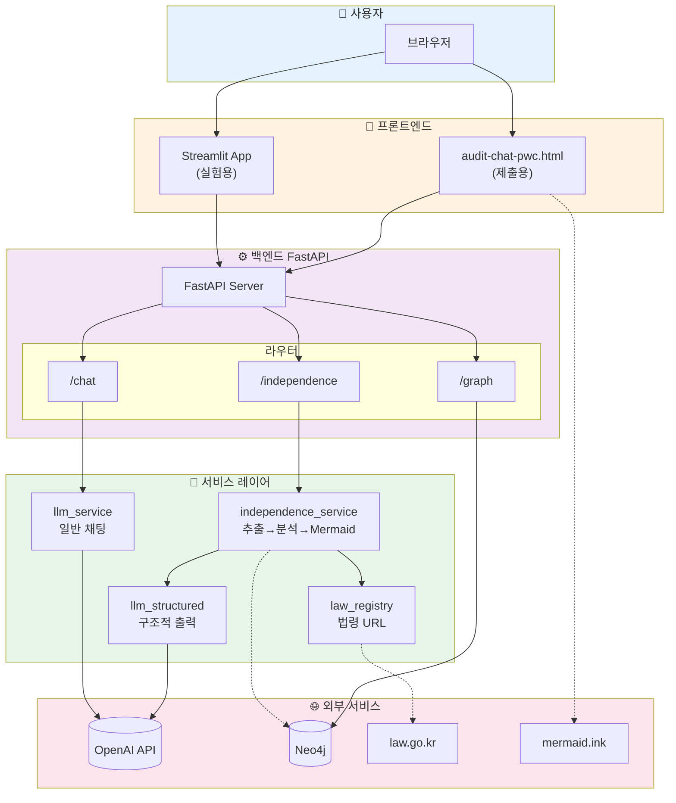
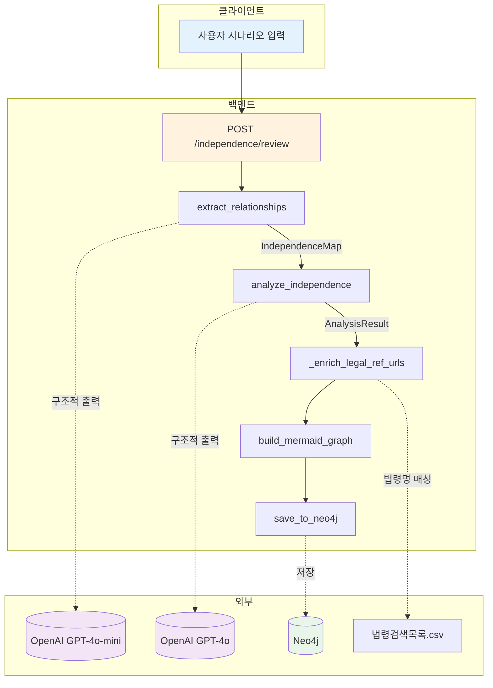
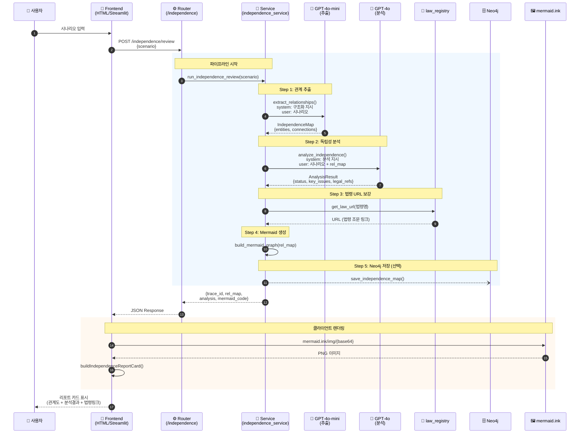
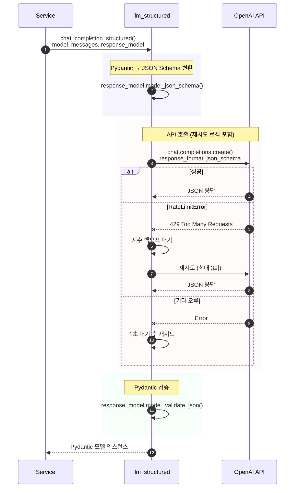
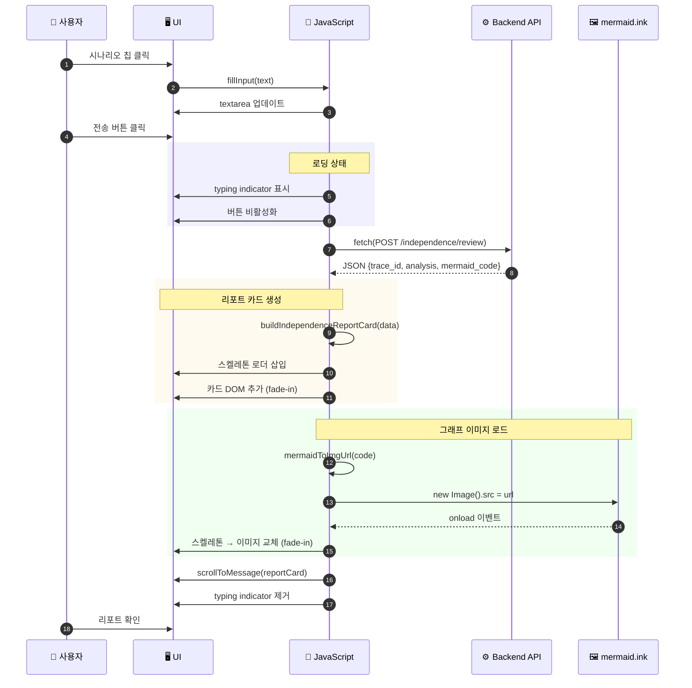
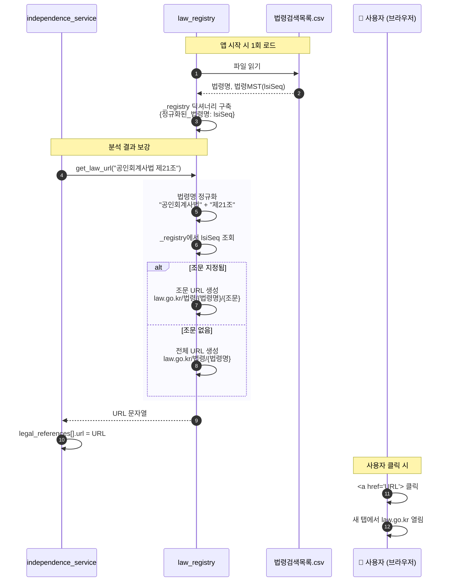
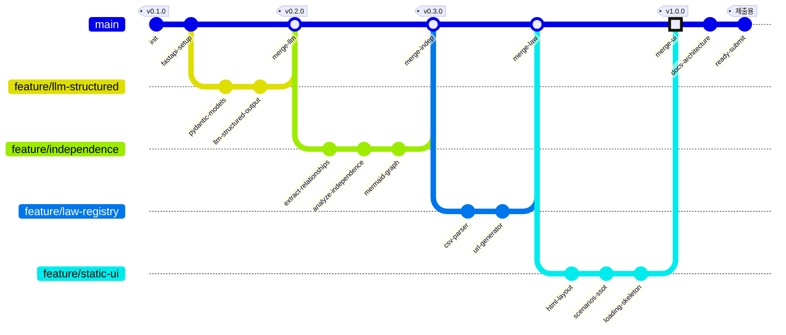
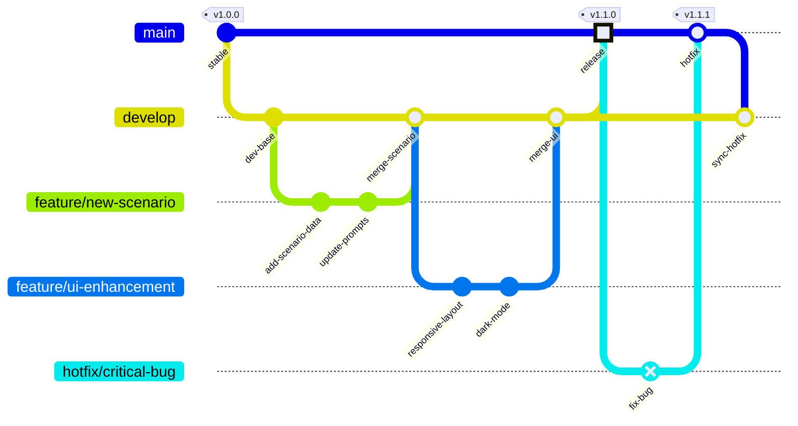
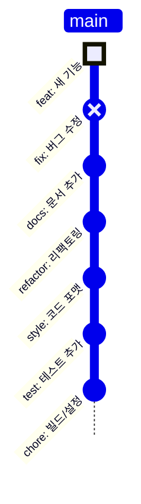
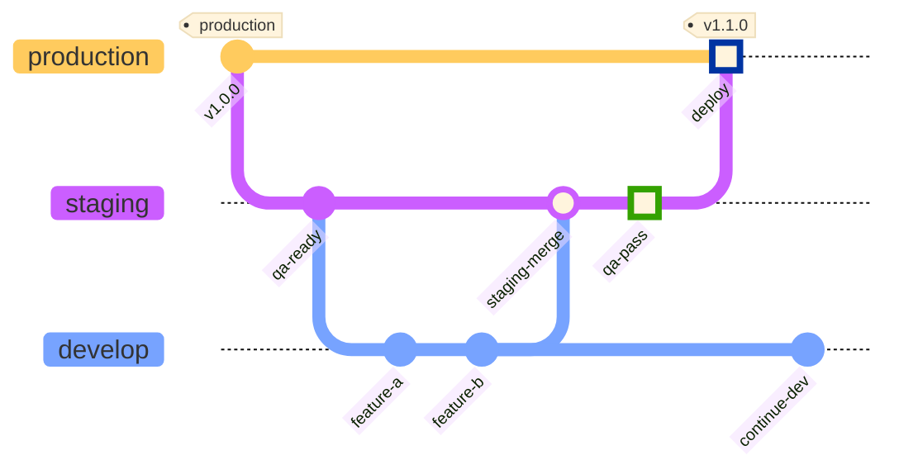

# Audit Chat Architecture

회계법인 제출용 포트폴리오 시스템 아키텍처 문서입니다.

---

## 1. Mermaid 전문가 검토

### 현재 구현 (`build_mermaid_graph`)

| 항목 | 현재 상태 | 평가 |
|------|----------|------|
| 다이어그램 타입 | `graph TD` (Flowchart Top-Down) | ✅ 관계 계층 표현에 적합 |
| 노드 모양 | 엔티티 유형별 shape 매핑 | ✅ 시각적 구분 명확 |
| 엣지 문법 | `-->｜rel｜` (표준) | ✅ mermaid.ink 완전 지원 |
| 한글 라벨 | `<br/>` 줄바꿈 + 클린업 | ✅ URL 인코딩 안정 |
| classDef/style | 미사용 | ⚠️ mermaid.ink 부분 지원, 현재 방식 권장 |

**개선 불필요** — 현재 flowchart 구현은 mermaid.ink 렌더링에 최적화되어 있음.

---

## 2. 시스템 아키텍처

### 2.1 Architecture Diagram (Mermaid v11.1.0+)

> ⚠️ `architecture-beta`는 Mermaid v11.1.0+ 필요. GitHub/일부 렌더러 미지원 시 2.2 Flowchart 버전 사용.


### 2.2 Architecture Diagram (Flowchart 호환 버전)



---

## 3. 레이어별 구성요소

### 3.1 진입로 (Entry Points)

| 구성요소 | 파일 | 용도 |
|----------|------|------|
| **정적 UI** | `static/audit-chat-pwc.html` | 회계법인 제출용 단일 페이지 |
| **Streamlit** | `frontend/app.py` | 내부 실험/데모용 멀티페이지 |

### 3.2 백엔드 (FastAPI)

| 라우터 | 엔드포인트 | 역할 |
|--------|-----------|------|
| `independence` | `POST /independence/review` | 독립성 검토 파이프라인 |
| `chat` | `POST /chat/completions` | 일반 채팅 (비구조화) |
| `graph` | `GET /graph/mermaid` | Neo4j → Mermaid 변환 |
| `health` | `GET /health` | 헬스체크 |

### 3.3 서비스 레이어

| 서비스 | 역할 |
|--------|------|
| `independence_service` | 추출 → 분석 → 법령보강 → Mermaid → Neo4j |
| `llm_structured` | 구조적 출력 (Pydantic + JSON 모드) |
| `llm_service` | 일반 채팅 (비구조화) |
| `law_registry` | 법령 URL 생성 (CSV 기반) |

### 3.4 외부 서비스

| 서비스 | 용도 |
|--------|------|
| **OpenAI API** | GPT-4o-mini (추출), GPT-4o (분석) |
| **Neo4j** | 엔티티/관계 저장, 그래프 조회 |
| **law.go.kr** | 법령 조문 링크 (사용자 클릭 시) |
| **mermaid.ink** | 관계도 이미지 렌더링 |

---

## 4. 독립성 검토 파이프라인 (Flowchart)



---

## 5. 시퀀스 다이어그램

### 5.1 독립성 검토 전체 흐름



### 5.2 LLM 구조적 출력 상세



### 5.3 프론트엔드 렌더링 흐름



### 5.4 법령 URL 생성 흐름



---

## 6. 데이터 흐름

```
시나리오 (str)
    │
    ▼
┌─────────────────────────────┐
│  extract_relationships      │ ──► LLM (GPT-4o-mini)
│  → IndependenceMap          │     구조적 출력
│    { entities, connections }│
└─────────────────────────────┘
    │
    ▼
┌─────────────────────────────┐
│  analyze_independence       │ ──► LLM (GPT-4o)
│  → AnalysisResult           │     구조적 출력
│    { status, key_issues,    │     (rel_map 참조)
│      legal_references, ... }│
└─────────────────────────────┘
    │
    ▼
┌─────────────────────────────┐
│  _enrich_legal_ref_urls     │ ──► law_registry
│  → legal_references[].url   │     CSV → URL 생성
└─────────────────────────────┘
    │
    ▼
┌─────────────────────────────┐
│  build_mermaid_graph        │ ──► Mermaid 문자열
│  → mermaid_code             │     (flowchart TD)
└─────────────────────────────┘
    │
    ▼
┌─────────────────────────────┐
│  Response                   │
│  { trace_id, rel_map,       │
│    analysis, mermaid_code } │
└─────────────────────────────┘
```

---

## 7. 파일 구조

```
audit-chat/
├── backend/
│   ├── main.py                 # FastAPI 앱 진입점
│   ├── config.py               # 설정 (Settings, .env)
│   ├── database.py             # Neo4j 드라이버
│   ├── routers/
│   │   ├── independence.py     # 독립성 검토 API
│   │   ├── chat.py             # 채팅 API
│   │   ├── graph.py            # 그래프 API
│   │   └── health.py           # 헬스체크
│   ├── services/
│   │   ├── independence_service.py  # 핵심 파이프라인
│   │   ├── llm_structured.py        # 구조적 LLM
│   │   └── llm_service.py           # 일반 LLM
│   ├── models/
│   │   ├── independence.py     # IndependenceMap, AnalysisResult
│   │   └── schemas.py          # 기타 스키마
│   └── utils/
│       └── law_registry.py     # 법령 URL 생성
├── frontend/
│   ├── app.py                  # Streamlit 앱
│   └── pages/                  # 멀티페이지
├── static/
│   └── audit-chat-pwc.html     # 제출용 정적 UI
├── 법령검색목록.csv             # 법령 데이터
├── requirements.txt
└── .env                        # 환경변수 (비공개)
```

---

## 8. 기술 스택

| 카테고리 | 기술 |
|----------|------|
| **Backend** | FastAPI, Pydantic, uvicorn |
| **Frontend** | HTML/CSS/JS (정적), Streamlit |
| **LLM** | OpenAI GPT-4o, GPT-4o-mini |
| **Database** | Neo4j (그래프) |
| **Visualization** | Mermaid.js (mermaid.ink) |
| **Configuration** | pydantic-settings, python-dotenv |

---

## 9. Git 브랜치 전략 (GitGraph)

### 9.1 프로젝트 개발 히스토리



### 9.2 권장 브랜치 전략 (Git Flow Lite)



### 9.3 기능별 브랜치 명명 규칙

| 브랜치 타입 | 패턴 | 예시 |
|------------|------|------|
| **Feature** | `feature/{기능명}` | `feature/new-scenario` |
| **Bugfix** | `bugfix/{이슈번호}` | `bugfix/issue-42` |
| **Hotfix** | `hotfix/{설명}` | `hotfix/critical-bug` |
| **Release** | `release/v{버전}` | `release/v1.2.0` |
| **Docs** | `docs/{문서명}` | `docs/architecture` |

### 9.4 커밋 타입 가이드



### 9.5 릴리즈 플로우



---

## 10. Mermaid 다이어그램 요약

| 섹션 | 다이어그램 타입 | 용도 |
|------|----------------|------|
| 2.1 | `architecture-beta` | 시스템 아키텍처 (v11.1.0+) |
| 2.2 | `flowchart TB` | 시스템 아키텍처 (호환) |
| 4 | `flowchart TD` | 독립성 검토 파이프라인 |
| 5.1 | `sequenceDiagram` | 전체 흐름 |
| 5.2 | `sequenceDiagram` | LLM 구조적 출력 |
| 5.3 | `sequenceDiagram` | 프론트엔드 렌더링 |
| 5.4 | `sequenceDiagram` | 법령 URL 생성 |
| 9.1 | `gitGraph` | 개발 히스토리 |
| 9.2 | `gitGraph` | 브랜치 전략 |
| 9.4 | `gitGraph TB:` | 커밋 타입 가이드 |
| 9.5 | `gitGraph` | 릴리즈 플로우 |

---

*이 문서는 아키텍처 변경 시 함께 갱신해야 합니다.*
